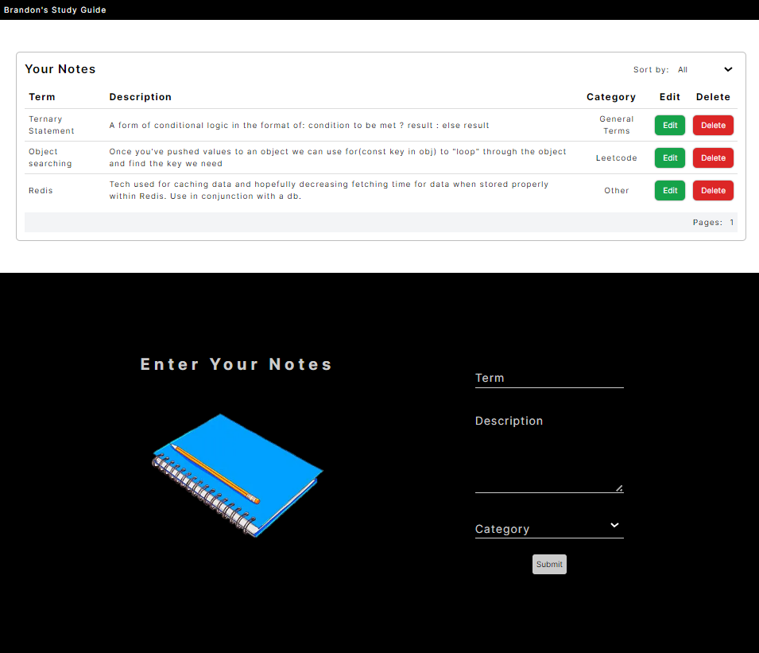

# Brandon's Personal Study Guide

## Link to deployed app

https://study-sheet.vercel.app

## Description

This study guide is a full stack app that uses NextJs, Mongodb, Prisma and Node. It allows anyone who knows the password to be able to input useful terms and conditions for future use. It also gives the user the ability to sort and see options based on which category they're looking for. For example, if we're looking to review common Leetcode terms and tricks, the user has the ability to search for this.

This was a fun app to do and a great refresher for designing clean, responsive, forms and tables. Anytime we're able to build CRUD applications and cement the basics of web development further into our brains, the better off we will be.